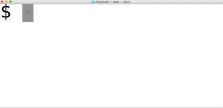
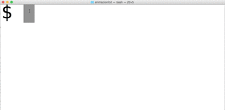
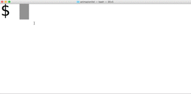
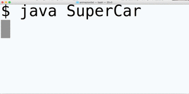

##Animazioni 1D
Per produrre delle semplici animazioni (su di una sola riga) si deve:

1. **Disegnare** un *frame* o *fotogramma* dell'animazione (nel nostro caso, un carattere o del testo ma senza mai *andare a capo*).
2. **Aspettare** un certo tempo. Ad esempio per ottenere un *frame rate* di 10 FPS, ossia 10 immagini al secondo, dovremo attendere circa 1 decimo di secondo (100 millisecondi).
3. **Cancellare** il frame corrente (nel nostro caso, ritornare all'inizio della riga) e ripetere dal punto 1.

Per provocare l'attesa necessaria a produrre il *frame rate* desiderato è opssibile utilizzare il metodo `sleep(int ms)` della classe `Thread` specificando il tempo di attesa espresso in millisecondi:

~~~java
try {
    Thread.sleep(100);
} catch (InterruptedException ex) {
}
~~~

Per cancellare il testo scritto (il *frame precedente*) bisogna far ritornare il cursore all'inizio della riga utilizzado il comando *Carriage Return* (`\n`). Ad esempio: 

~~~java
	System.out.print("\r");
~~~

Il *ciclo di animazione* per 10 FPS sarebbe quindi:

~~~java
while(true){
	//stampa un frame
	System.out.print("???????");

	//attendi 100 ms
	try {
   		Thread.sleep(100);
	} catch (InterruptedException ex) {
	}
	//carriage return (torna a inizio riga)
	System.out.print("\r");
}
~~~

Purtroppo la console di Netbeans non interpreta correttamente il codice *Carriage Return*, quindi per eseguire queste animazioni dovrete usare la shell...

###Elica
Scrivi il programma `Elica` che produce a terminale l'animazione di un elica stilizzata stampando ripetutamente la sequenza di caratteri '|','\','-','/'. Vedi il filmato:

###Bimotore
Scrivi il programma `Bimotore ` che produce a terminale l'animazione di un aereoplano bimotore stilizzato:

###Domino
Scrivi il programma `SuperCar ` che produce l'animazione seguente:

###SuperCar
Scrivi il programma `SuperCar ` che produce l'animazione seguente:

###Orologio
