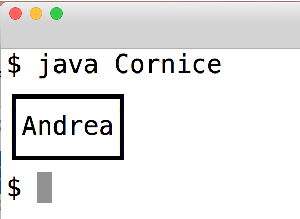

# Variabili e tipi di dati

## Dichiara e assegna
Scrivere un programma contenente:
	
- la dichiarazione della variabile intera (32 bit) "intero", e assegnategli il valore esadecimale AB
- la dichiarazione della variabile intera (16 bit) "corto", e assegnategli il valore ottale 445
- la dichiarazione della variabile intera (32 bit) "intero", e assegnategli il valore decimale 111
- la dichiarazione della variabile intera (64 bit) "lungo", e assegnategli il valore decimale 222
- Stampate a terminale il nome e il valore di ognuna delle variabili dichiarate

Considera il codice che hai scritto. Quanta memoria verrà occupata per le variabili che hai dichiarato?

## PariDispari
Scrivi un programma che, dato il numero di argomenti da linea di comando (N), stampa a terminale: "N è pari" oppure "N è dispari".

## Multipli di 5
Scrivi un programma che, dato il numero di argomenti da linea di comando (N), stampa a terminale: "N è multiplo di 5" oppure "N non è multiplo di 5".

## Cornice
Scrivi un programma che scriva a terminale il tuo nome utilizzando i caratteri Unicode della pagina [U2500](http://www.unicode.org/charts/PDF/U2500.pdf). Esempio:

Nota: Su alcune shell i caratteri unicode potrebbe essere rappresentati in modo errato.

## UnicodePortrait
Usa i caratteri unicode che preferisci per disegnare il tuo autoritratto. Vedi [unicode.org](http://www.unicode.org/charts/).

